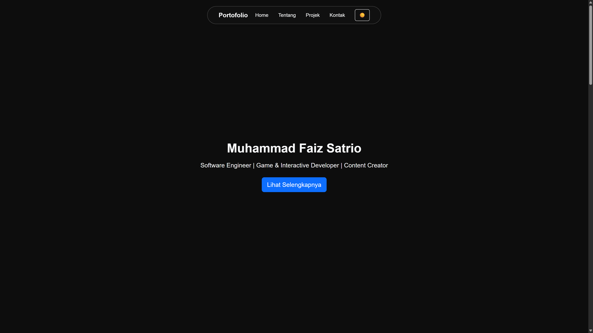

# 🌐 Portofolio — M. Faiz Satrio

Selamat datang di repositori **portofolio pribadi** saya — sebuah website interaktif yang menampilkan profil, pengalaman, dan karya saya sebagai **Web Developer & Designer**.  
Dibangun menggunakan **Node.js (Express + EJS)**, **Bootstrap 5**, dan **JavaScript murni**, dengan dukungan **Dark Mode adaptif** dan **desain “liquid glass” responsif.**

---

## 🚀 Live Demo

🔗 **[Lihat versi live di Vercel](https://mfaizsatrio-portofolio.vercel.app/)**

---

## 💼 Tentang Saya

Saya adalah **M. Faiz Satrio**, seorang **Web Developer & Creative Technologist** yang berfokus pada pengembangan antarmuka modern, responsif, dan estetik.  
Saya memiliki ketertarikan kuat pada integrasi antara **desain visual, pemrograman interaktif, dan sistem real-time** (seperti OSC, WebSocket, dan integrasi multimedia).

**Keahlian utama:**

- 💻 Web Development (HTML, CSS, JavaScript, Node.js, Express)
- 🎨 UI/UX Design (Figma, prototyping, visual balance)
- ⚙️ Backend & Database Integration
- 🧩 Creative Coding (Unity, TouchDesigner, Unreal)
- ☁️ Deployment & CI/CD (Vercel, Heroku, cPanel)

---

## 🧩 Fitur Utama Website

✨ **Desain “Liquid Glass” Navbar** — efek kaca transparan yang tetap melayang di layar.  
🌙 **Dark/Light Mode Adaptif** — otomatis menyesuaikan dengan tema sistem pengguna.  
📱 **Responsif Penuh** — navbar berubah menjadi floating burger menu di mobile.  
💬 **Formulir Kontak Interaktif** — siap diintegrasikan dengan backend/email.  
🌐 **Media Sosial Terhubung** — LinkedIn, GitHub, dan Instagram.  
🎭 **Animasi Halus & Transisi Warna** — fokus pada kenyamanan visual.

---

## 🛠️ Teknologi yang Digunakan

| Teknologi                | Deskripsi                               |
| ------------------------ | --------------------------------------- |
| **Node.js + Express**    | Server backend dengan templating EJS    |
| **EJS**                  | Template engine untuk rendering dinamis |
| **Bootstrap 5.3**        | Framework CSS responsif modern          |
| **Bootstrap Icons**      | Ikon vektor ringan untuk UI             |
| **JavaScript (Vanilla)** | Logika tema & interaktivitas            |
| **Vercel**               | Platform hosting & CI/CD                |

---

## 📂 Struktur Proyek

portofolio/
├── server.js
├── package.json
├── views/
│ └── index.ejs
├── public/
│ ├── css/
│ │ └── style.css
│ ├── js/
│ │ └── script.js
│ └── assets/
│ └── (gambar proyek & ikon)
└── README.md

---

## 📬 Kontak

Jika kamu tertarik untuk berkolaborasi, jangan ragu untuk menghubungi saya melalui:

- **📧 Email:** m.faizsatrio@gmail.com
- **💼 LinkedIn:** [linkedin.com/in/mfaizsatrio](https://www.linkedin.com/in/mfaizsatrio)
- **💻 GitHub:** [github.com/BanTrexx](https://github.com/BanTrexx)
- **📸 Instagram:** [instagram.com/mfaizsatrio](https://instagram.com/mfaizsatrio)

---

## ⚖️ Lisensi

Proyek ini bersifat **open source** di bawah lisensi **MIT**.  
Kamu bebas menggunakannya untuk belajar, mengembangkan, atau menginspirasi karya kamu sendiri, dengan tetap mencantumkan kredit yang sesuai.

---

**Dibuat dengan ❤️ oleh [M. Faiz Satrio](https://mfaizsatrio-portofolio.vercel.app/)**
